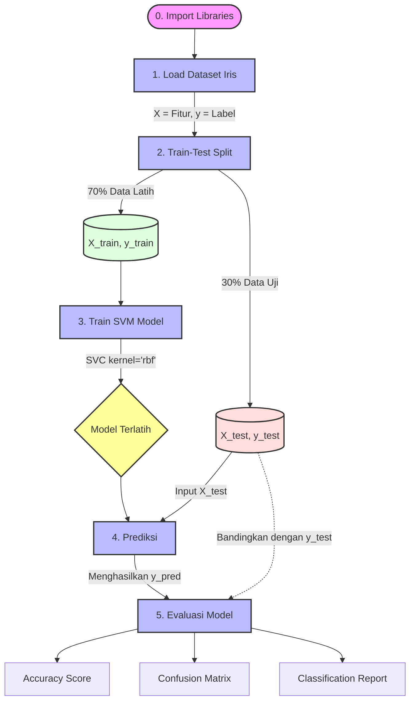
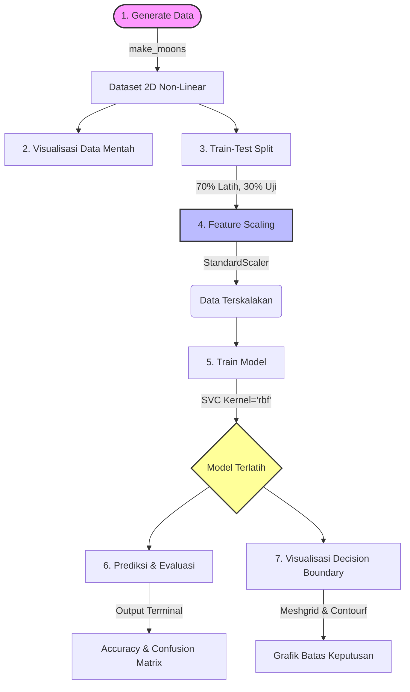
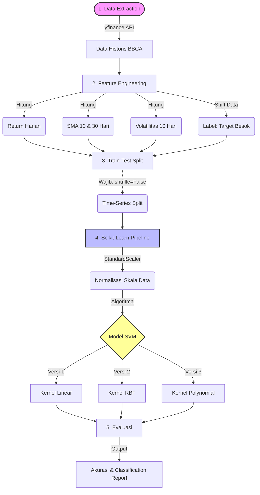

# Klasifikasi Bunga Iris menggunakan Support Vector Machine (SVM)

Proyek sederhana ini mendemonstrasikan *pipeline machine learning* dasar untuk melakukan klasifikasi pada dataset bunga Iris menggunakan algoritma **Support Vector Classifier (SVC)** dari *library* `scikit-learn`.

## 🔄 Pipeline Model

Berikut adalah alur data dari tahap pemuatan hingga evaluasi:



## 💻 Kode Program

Pastikan sudah menginstal `scikit-learn` sebelum menjalankan program ini. instalnya dengan perintah `pip install scikit-learn`.

```python
# Import libraries
from sklearn.svm import SVC
from sklearn.datasets import load_iris
from sklearn.model_selection import train_test_split
from sklearn.metrics import accuracy_score, confusion_matrix, classification_report

# 1. Load dataset Iris
data = load_iris()
X = data.data # Fitur (sepal length, sepal width, petal length, petal width)
y = data.target # Label (setosa, versicolor, virginica)

# 2. Split data menjadi training dan testing set
X_train, X_test, y_train, y_test = train_test_split(X, y, test_size=0.3, random_state=42)

# 3. Train SVM model dengan kernel RBF
model = SVC(kernel='rbf', C=1.0) # Kernel RBF dan C=1.0
model.fit(X_train, y_train)

# 4. Prediksi hasil pada data uji
y_pred = model.predict(X_test)

# 5. Evaluasi model
accuracy = accuracy_score(y_test, y_pred)
conf_matrix = confusion_matrix(y_test, y_pred)
class_report = classification_report(y_test, y_pred)

# Output hasil evaluasi
print(f'Accuracy: {accuracy * 100:.2f}%')
print("Confusion Matrix:")
print(conf_matrix)
print("\nClassification Report:")
print(class_report)
```

## 📊 Hasil Evaluasi

Saat program dijalankan, model akan mengeluarkan metrik evaluasi berupa tingkat akurasi (dalam persen), *confusion matrix* untuk melihat detail tebakan per kelas, dan *classification report* yang memuat *precision, recall,* dan *f1-score*.

# Klasifikasi Dataset Non-Linear (Make Moons) menggunakan Support Vector Machine (SVM)


## 📌 Deskripsi Proyek
Proyek ini adalah demonstrasi fundamental dari kekuatan algoritma **Support Vector Machine (SVM)** saat menangani dataset yang tidak dapat dipisahkan secara linear (*non-linear dataset*). 

Kita menggunakan dataset sintetik bawaan scikit-learn yaitu `make_moons`, yang menghasilkan dua kelas data berbentuk bulan sabit yang saling bersinggungan. Melalui proyek ini, kita membuktikan bahwa menggunakan SVM dengan **Kernel RBF (Radial Basis Function)** memungkinkan model untuk meliukkan batas keputusannya (*decision boundary*) dan mengklasifikasikan data dengan akurasi tinggi, sesuatu yang tidak bisa dilakukan oleh model linear biasa.

## 🔄 Pipeline Machine Learning

Berikut adalah visualisasi alur kerja program dari awal hingga akhir:



## 🛠️ Penjelasan Alur Program (Step-by-Step)

Program ini dibagi menjadi 8 tahapan logis:

1. **Pembuatan Data (Generate Data):** Menggunakan fungsi `make_moons` untuk membuat 300 sampel data dua dimensi (Feature 1 dan Feature 2) yang dibagi menjadi dua kelas (Kelas 0 dan Kelas 1). Parameter `noise=0.2` ditambahkan agar data sedikit acak dan lebih realistis.
2. **Visualisasi Awal:** Menampilkan titik-titik data mentah menggunakan `matplotlib` untuk melihat bentuk "bulan sabit" dari dataset sebelum diproses.
3. **Pemisahan Data (Train-Test Split):** Memecah data dengan rasio 70:30. 70% data digunakan untuk melatih model, dan 30% sisanya disembunyikan untuk menguji performa model nanti.
4. **Normalisasi Skala (Feature Scaling):** Menggunakan `StandardScaler`. Ini adalah **langkah krusial** untuk algoritma SVM karena SVM beroperasi berdasarkan perhitungan jarak antar titik. Jika skala antar fitur berbeda jauh, model akan bias.
5. **Pelatihan Model (Training):** Menginisialisasi dan melatih model SVM menggunakan **Kernel RBF** (`kernel='rbf'`). Parameter `C=1.0` mengatur keseimbangan margin toleransi, dan `gamma='scale'` mengatur radius pengaruh dari setiap titik data latih.
6. **Prediksi:** Model menebak kelas dari data uji (30% data yang disembunyikan tadi) yang telah dinormalisasi.
7. **Evaluasi Metrik:** Menghitung skor numerik kinerja model, menghasilkan keluaran berupa persentase *Accuracy*, *Confusion Matrix* (untuk melihat detail benar/salah tebak per kelas), dan *Classification Report*.
8. **Plotting Decision Boundary:** Tahap visualisasi akhir. Program membuat sebuah *grid* buatan yang menyelimuti seluruh area grafik, melakukan normalisasi skala pada *grid* tersebut, lalu menyuruh model memprediksi setiap titik di dalam *grid*. Hasilnya adalah grafik kontur (*contour plot*) berwarna yang menunjukkan area kekuasaan Kelas 0 (biru/merah) dan area kekuasaan Kelas 1.

## 📊 Interpretasi Hasil Visual

Saat program dijalankan, Anda akan melihat dua buah grafik:
* **Grafik Pertama:** Menunjukkan titik merah dan titik biru yang saling melengkung layaknya logo *yin-yang*. Titik-titik ini tidak bisa dipisahkan hanya dengan menarik satu garis lurus.
* **Grafik Kedua:** Menunjukkan latar belakang yang telah diwarnai oleh model (Area Keputusan). Anda akan melihat batas warna tersebut berhasil "meliuk" mengikuti kontur data yang berbentuk bulan sabit. Ini adalah bukti visual dari cara kerja dimensi tinggi (matematika ruang Hilbert) yang dioperasikan oleh Kernel RBF.

## 🚀 Cara Menjalankan Program

Pastikan *environment* Python Anda sudah memiliki pustaka berikut:
```bash
pip install numpy matplotlib scikit-learn
```
Setelah itu, cukup jalankan skrip Python, dan hasil evaluasi beserta grafiknya akan langsung muncul di layar.

# Hasil Ujicoba atau Test terhadap BBCA Stock Movement Prediction using Support Vector Machine (SVM)


## 📌 Tentang Proyek
Proyek ini mengimplementasikan algoritma **Support Vector Machine (SVM)** untuk memprediksi arah pergerakan harian harga saham PT Bank Central Asia Tbk (BBCA). Alih-alih memprediksi harga pasti, model ini melakukan klasifikasi biner: apakah harga penutupan esok hari akan **Naik (1)** atau **Turun/Tetap (0)**.

Proyek ini juga membandingkan tiga konfigurasi kernel SVM (Linear, RBF, dan Polynomial) untuk menguji hipotesis matematis mana yang paling cocok dengan perilaku fluktuasi pasar saham.

## 🧠 Filosofi di Balik Program (Apa & Mengapa?)

### Sebenarnya Apa Sih Program Ini?
Program ini bertindak layaknya seorang analis kuantitatif yang tidak pernah tidur. Sistem kecerdasan buatan (*machine learning*) ini bertugas menjawab satu pertanyaan spesifik berdasarkan data historis: **"Melihat tren hari ini dan beberapa hari ke belakang, ke mana arah saham BBCA besok?"**
Program tidak menganalisis berita ekonomi atau laporan keuangan. Model ini murni mengandalkan indikator statistik historis (seperti *Moving Average* dan tingkat volatilitas) untuk mencari pola matematis yang tersembunyi di balik pergerakan harga.

### Mengapa Menggunakan Support Vector Machine (SVM)?
Pasar saham itu sangat bising (*noisy*) dan penuh anomali. SVM dipilih karena algoritma ini dirancang khusus untuk mencari **batas keputusan (*hyperplane*)** terbaik yang memisahkan dua kelas data (hari "Naik" dan hari "Turun"). 
Dari sudut pandang matematika, proses ini pada dasarnya adalah problem optimasi numerik tingkat tinggi (memiliki kedekatan filosofis dengan metode optimasi seperti DFP atau BFGS) di mana algoritma berusaha mencari titik ekstremum untuk meminimalkan *error* klasifikasi sekaligus memaksimalkan margin toleransi antar data.

## 🔄 Pipeline Machine Learning

Alur kerja data dari pengambilan *real-time* hingga prediksi direpresentasikan dalam diagram berikut:



## 🧪 Skenario Eksperimen & Hasil (Periode 2022-2026)

Kami menguji tiga versi arsitektur model:

1. **Versi 1: Linear Kernel (C=0.1)**
   * **Konsep:** Margin lebar untuk menoleransi *noise* pasar saham.
   * **Hasil (58.42%):** Akurasi tertinggi. Menunjukkan bahwa model sederhana yang tidak mudah *overfitting* bekerja paling baik di pasar yang sangat fluktuatif.
2. **Versi 2: RBF Kernel (C=10.0, Gamma=0.1)**
   * **Konsep:** Model kompleks yang dipaksa menghafal pola dengan ketat.
   * **Hasil (58.06%):** Terkena *overfitting*. Pola masa lalu yang dihafal model tidak selalu terulang secara identik di masa depan.
3. **Versi 3: Polynomial Kernel (Degree 3)**
   * **Konsep:** Mencoba mencocokkan pola pergerakan harga dengan kurva polinomial derajat tiga.
   * **Hasil (55.91%):** Akurasi terendah, membuktikan bahwa pergerakan pasar saham tidak mengikuti fungsi matematis yang kaku.

## 💡 Kesimpulan Pembelajaran
Akurasi tertinggi berada di angka ~58%. Dalam ranah *quant trading*, mampu memprediksi arah pasar lebih baik dari sekadar peluang acak (50%) adalah sebuah pencapaian. Namun, hal ini juga membuktikan secara kuantitatif bahwa *timing the market* secara harian sangat sulit. Model ini secara tidak langsung memvalidasi bahwa strategi investasi rutin berkala (*Dollar Cost Averaging*) secara konsisten merupakan pendekatan yang lebih stabil menghadapi volatilitas pasar.

## 🚀 Cara Penggunaan
1. Pastikan Anda telah menginstal pustaka yang dibutuhkan:
   `pip install yfinance pandas numpy scikit-learn`
2. Jalankan skrip Python utama. Program akan otomatis mengunduh data terbaru dari Yahoo Finance dan melatih model secara *real-time*.
