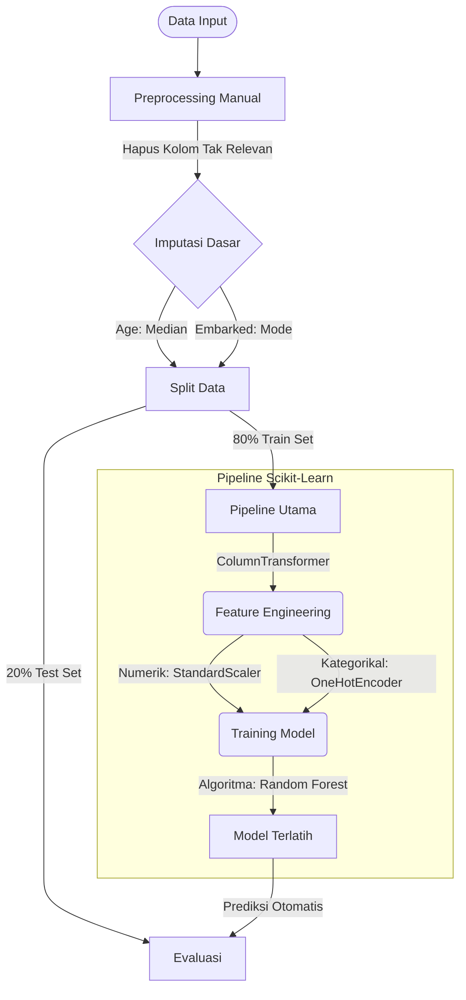

# Titanic Survival Prediction using Scikit-Learn Pipeline


## 📌 Deskripsi Proyek
Proyek ini bertujuan untuk memprediksi tingkat keselamatan penumpang kapal Titanic berdasarkan berbagai fitur seperti umur, jenis kelamin, kelas tiket, dan tarif.

Fokus utama dari kode ini adalah mendemonstrasikan **praktik terbaik (best practices)** dalam membangun workflow Machine Learning menggunakan algoritma **Random Forest** melalui pemanfaatan `Pipeline` dan `ColumnTransformer` dari *scikit-learn*. Pendekatan ini memastikan kode yang bersih, mencegah kebocoran data (*data leakage*), dan mempermudah deployment model.

## 📊 Dataset
Dataset yang digunakan adalah dataset Titanic yang terkenal, diambil langsung dari arsip Stanford CS109.

* **Source URL:** `https://web.stanford.edu/class/archive/cs/cs109/cs109.1166/stuff/titanic.csv`
* **Target Variabel:** `Survived` (0 = Tidak Selamat, 1 = Selamat)

## 🛠️ Langkah-langkah Pipeline

Berikut adalah visualisasi alur kerja data dalam proyek ini:



**Detail Proses:**
1.  **Pembersihan:** Menghapus fitur non-prediktif (`PassengerId`, `Name`, `Ticket`, `Cabin`).
2.  **Imputasi:** Mengisi nilai 'Age' yang hilang dengan median dan 'Embarked' dengan modus.
3.  **Transformasi (via `ColumnTransformer`):**
    * **Fitur Numerik:** Standarisasi skala menggunakan `StandardScaler`.
    * **Fitur Kategorikal:** Encoding variabel teks menggunakan `OneHotEncoder`.
4.  **Pemodelan:** Klasifikasi menggunakan algoritma **Random Forest**.

## 🚀 Cara Menjalankan

### Prasyarat
Pastikan Anda sudah menginstal pustaka yang diperlukan:

```bash
pip install pandas scikit-learn
```

### Menjalankan Kode
Anda bisa menyalin kode berikut ke dalam file Python (misal: `titanic_classification.py`) dan menjalankannya.

```python
# ==========================================
# TITANIC SURVIVAL PREDICTION WITH PIPELINE
# ==========================================

import pandas as pd
from sklearn.model_selection import train_test_split
from sklearn.ensemble import RandomForestClassifier
from sklearn.metrics import accuracy_score, confusion_matrix
from sklearn.preprocessing import StandardScaler, OneHotEncoder
from sklearn.compose import ColumnTransformer
from sklearn.pipeline import Pipeline

# 1. PENGUMPULAN DATA (LOAD DATA)
print("Loading data...")
url = '[https://web.stanford.edu/class/archive/cs/cs109/cs109.1166/stuff/titanic.csv](https://web.stanford.edu/class/archive/cs/cs109/cs109.1166/stuff/titanic.csv)'
data = pd.read_csv(url)

# 2. PREPROCESSING MANUAL
# Menghapus kolom yang tidak relevan dengan keselamatan
columns_to_drop = ['PassengerId', 'Name', 'Ticket', 'Cabin']
data = data.drop([col for col in columns_to_drop if col in data.columns], axis=1)

# Menangani Missing Values (Data Kosong) secara manual
if 'Age' in data.columns:
    data['Age'].fillna(data['Age'].median(), inplace=True)

if 'Embarked' in data.columns:
    data['Embarked'].fillna(data['Embarked'].mode(), inplace=True)

# 3. SPLIT DATA (Memisahkan Target dan Fitur)
X = data.drop('Survived', axis=1) # Fitur (input)
y = data['Survived']              # Target (output)

X_train, X_test, y_train, y_test = train_test_split(X, y, test_size=0.2, random_state=42)

# 4. FEATURE ENGINEERING PIPELINE (Menggunakan ColumnTransformer)
# Definisi fitur berdasarkan tipe
numeric_features = ['Age', 'Fare']
categorical_features = ['Sex']
if 'Embarked' in data.columns:
    categorical_features.append('Embarked')

# Transformasi untuk angka: Standarisasi
numeric_transformer = Pipeline(steps=[
    ('scaler', StandardScaler())
])

# Transformasi untuk kategori: One-Hot Encoding
categorical_transformer = Pipeline(steps=[
    ('onehot', OneHotEncoder(handle_unknown='ignore'))
])

# Menggabungkan pemrosesan berdasarkan kolom
preprocessor = ColumnTransformer(
    transformers=[
        ('num', numeric_transformer, numeric_features),
        ('cat', categorical_transformer, categorical_features)
    ])

# 5. MODEL PIPELINE (Menggabungkan Preprocessing dan Model)
model = Pipeline(steps=[
    ('preprocessor', preprocessor),
    ('classifier', RandomForestClassifier(n_estimators=100, random_state=42))
])

# 6. PELATIHAN MODEL (TRAINING)
print("Training model...")
model.fit(X_train, y_train)

# 7. EVALUASI MODEL
print("Evaluating model...")
y_pred = model.predict(X_test)

# Output hasil evaluasi
print("\n" + "="*30)
print(f"HASIL EVALUASI MODEL")
print("="*30)
print(f"Akurasi: {accuracy_score(y_test, y_pred):.4f} ({accuracy_score(y_test, y_pred)*100:.2f}%)")
print("\nConfusion Matrix:")
print(confusion_matrix(y_test, y_pred))
print("="*30)
```

## 📈 Hasil
Setelah dijalankan, model akan menampilkan tingkat akurasi pada data uji (20% dari total data) beserta Confusion Matrix-nya. Hasil dapat bervariasi sedikit tergantung versi library, namun umumnya akurasi akan berkisar di angka **~80-83%**.

## 📄 Lisensi
Proyek ini bersifat open-source di bawah lisensi MIT.
